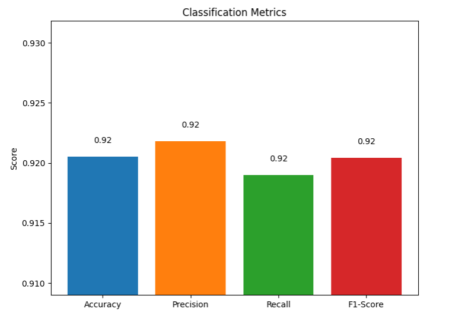
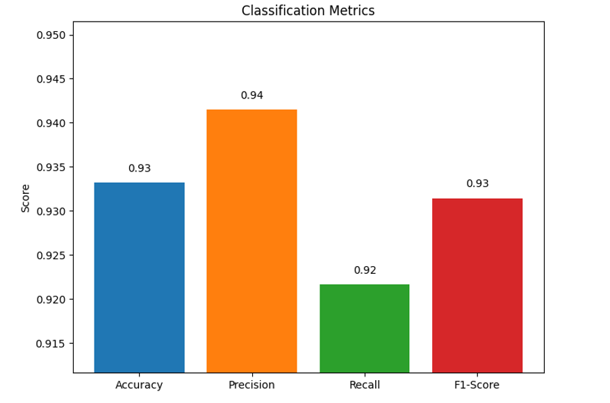
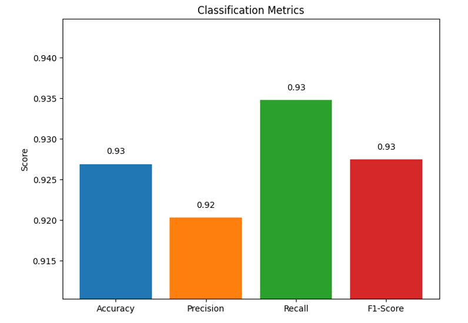
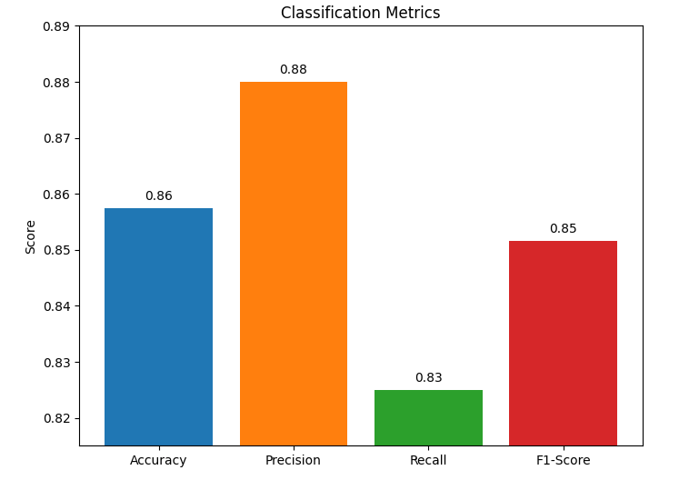
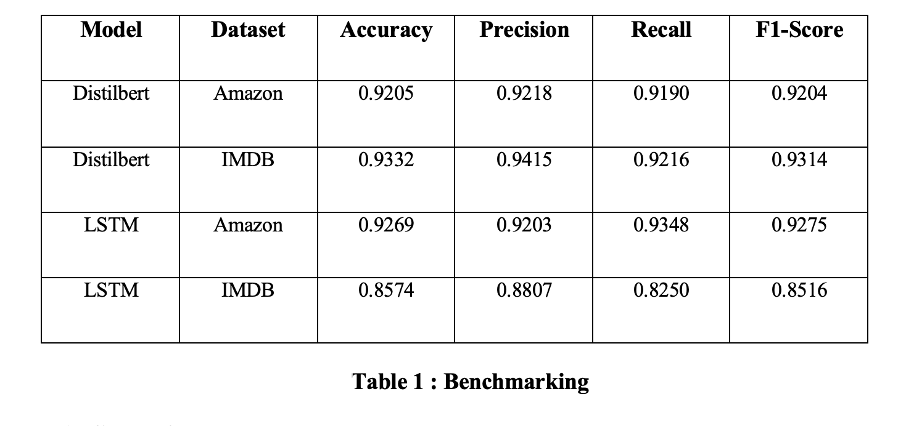

### CSE561 advancad natural language course project

Sentiment analysis is one of the natural language processing (NLP) techniques that aim to extract sentiment from text data. In this study, a comparative analysis will be performed with two different deep learning methods, BERT and LSTM models, using Amazon and IMDB review datasets.

The scope of the project:
-   Fine-tuning the BERT model with transfer learning
-   Training the LSTM model from scratch
-   Comparing the performance of the models on different datasets
-   Evaluating success with metrics such as F1-score, accuracy, precision-recall
-   Visualization of the results is aimed.

#### Models

-   DistilBert
-   LSTM

#### Datasets

-   Amazon Review Dataset
-   IMDB Review Dataset

#### Distilbert Model with Amazon Dataset

#### Distilbert Model with IMDB Dataset

#### LSTM Model with Amazon Dataset

#### LSTM Model With IMDB Dataset

#### Benchmark Table

